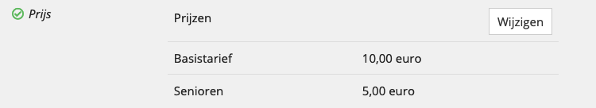

# Registering events

This guide will explain how to register an event as an UiTPAS event. This is required to be able to:

- **Calculate UiTPAS prices (discounts)** for tickets to attend the event
- **Register ticket sales** so the organizer of the event can receive compensation for the discount

## Registering the event in UiTdatabank

To register an UiTPAS event, it needs to exist in UiTdatabank first. UiTdatabank is a central database of cultural and leisure activities in Flanders and Brussels, including events of organizers that work with UiTPAS.

You can register the event in UiTdatabank in two ways: If you only need to register a handful of events, the easiest way is through UiTdatabank's user interface. However, if you need to import more events (>100 per year) you can programmatically import your events using UiTdatabank's Entry API.

### 1. Via the user interface

You can manually enter events in UiTdatabank by browsing to https://www.uitdatabank.be.

If you need help how to do this you can find more info in [our helpdesk article](https://helpdesk.publiq.be/hc/nl/articles/360016331140-Hulp-bij-het-invoeren-van-een-evenement) creating events in UiTdatabank.

### 2. Via UiTdatabank's Entry API

To learn how to import your event programmatically through UiTdatabank's Entry API, [consult the UiTdatabank documentation for event imports](https://documentatie.uitdatabank.be/content/json-ld-crud-api/latest/events.html). (This documentation will be moved to this new documentation portal at a later stage.)

## Making your event an UiTPAS event

An event in UiTdatabank automatically becomes registered as an UiTPAS event if it satisfies the following criteria:

- It has a (base) price that is not free
- It is linked to a known UiTPAS organiser

Again you can provide this info manually via UiTdatabank's user interface, or programmatically through UiTdatabank's Entry API.

### 1. Via the user interface

Start by editing the _Prijs_ field of your event, and provide a _Basistarief_ that is not 0 EUR.

For example:

Next, click the _Organisatie toevoegen_ button. You can now look for the organizer of the event by typing its name in the input field that has appeared, and then select it from the list of possible options that appears. If multiple options appear, make sure to select the one that has a grey _UiTPAS_ badge next to it.

Shortly after you have selected an UiTPAS organizer, you should see a new _UiTPAS_ field appear in the form that looks like this:

Your event is now registered as an UiTPAS event, and you can optionally change the possible card systems that it belongs to if the UiTPAS organizer is active in multiple card systems.

You can now use its id in UiTPAS API requests that require an event id, for example to register a ticket sale for it. You can find this id in the URL of the event's detail or edit page on UiTdatabank.

### 2. Via UiTdatabank's Entry API

\[TODO: provide links how to set price and organizer]

\[TODO: provide a list of known UiTPAS organizers, or how to find the one(s) you need]

